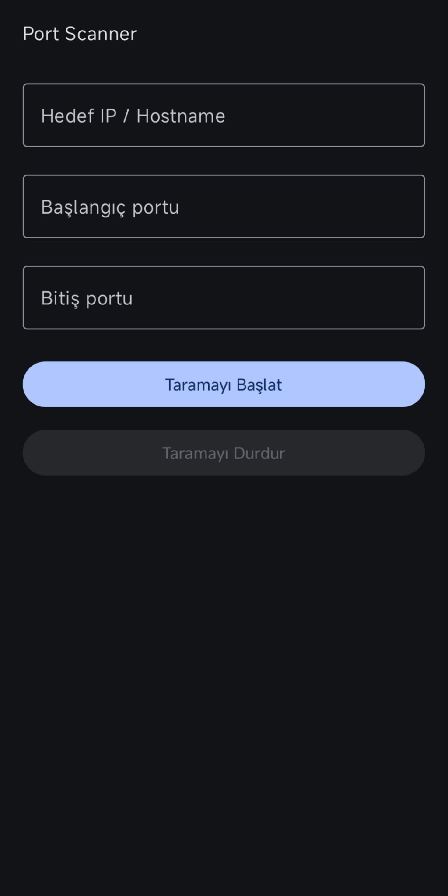

# Port Scanner

Android üzerinde çalışan, Kotlin ve Jetpack Compose kullanılarak geliştirilmiş basit ve kontrollü bir TCP port tarama uygulaması.

Uygulama, kullanıcının yetkili olduğu hedeflerde belirlenen TCP port aralığını kontrol ederek açık portları ve port numarasına göre tahmin edilen muhtemel servisleri gösterir.

> Bu proje ağ güvenliği ve Android geliştirme amacıyla hazırlanmıştır. Yalnızca yetkili olduğunuz sistemlerde kullanın.

## Özellikler

* IP adresi veya hostname ile hedef belirleme
* Özel port aralığı seçme
* TCP Connect Scan
* Kontrollü paralel tarama
* Canlı tarama ilerlemesi
* Açık portların canlı gösterimi
* Tarama durdurma
* Timeout ve temel hata yönetimi
* Muhtemel servis adı gösterimi
* Tarama özeti
* Taranan port sayısı
* Açık port sayısı
* Tarama süresi

## Teknolojiler

* Kotlin
* Android
* Jetpack Compose
* Material 3
* Kotlin Coroutines
* Java/Kotlin Socket API

## Gereksinimler

* Android Studio
* Android SDK
* Kotlin
* Android 8.0 (API 26) veya üzeri

## Kurulum

Projeyi klonlayın:

```bash
git clone https://github.com/egehanvx/PortScanner.git
```

Projeyi Android Studio ile açın.

Gradle senkronizasyonunun tamamlanmasını bekleyin ve uygulamayı Android cihaz veya emülatörde çalıştırın.

## Kullanım

1. Hedef IP adresini veya hostname'i girin.
2. Başlangıç portunu girin.
3. Bitiş portunu girin.
4. `Taramayı Başlat` butonuna basın.
5. Tarama ilerlemesini ve bulunan açık portları takip edin.

Örnek:

```text
Hedef: 192.168.1.1
Başlangıç: 1
Bitiş: 1024
```

Örnek sonuç:

```text
22 - OPEN - Muhtemel servis: SSH
80 - OPEN - Muhtemel servis: HTTP
443 - OPEN - Muhtemel servis: HTTPS
```

Servis isimleri yalnızca port numarasına göre yapılan tahminlerdir ve kesin servis tespiti anlamına gelmez.

## Ekran Görüntüleri



## Güvenlik ve Sorumlu Kullanım

Bu uygulama eğitim, ağ teşhisi ve yetkili güvenlik testleri amacıyla geliştirilmiştir.

Yalnızca sahibi olduğunuz veya açıkça tarama izniniz bulunan sistemleri tarayın.

Yetkisiz sistemlerin taranmasından doğabilecek sonuçlardan kullanıcı sorumludur.

## Gelecekte Eklenebilecek Özellikler

* Yaygın portlar için hazır tarama profilleri
* Tarama geçmişi
* TXT/CSV dışa aktarma
* Daha gelişmiş sonuç filtreleme
* Daha fazla servis eşlemesi
* Kullanıcı tarafından ayarlanabilir timeout
* Kullanıcı tarafından ayarlanabilir tarama concurrency değeri

## Lisans

Bu proje MIT License altında yayımlanmıştır.
